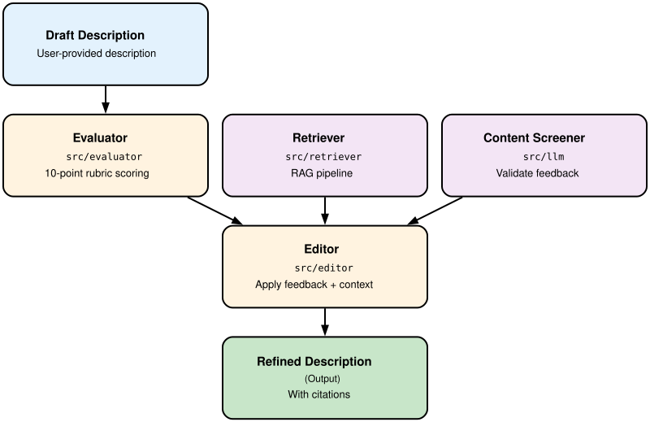

# Rocco: AI Curator for Dataset Descriptions

[](https://opensource.org/licenses/MIT)
[](https://www.python.org/downloads/)
[](https://doi.org/10.5281/zenodo.20172375)

Rocco is an AI-powered research assistant framework for the [Digital Porous Media (DPM) Portal](https://digitalporousmedia.org/). It ships two modules:

- **Description Curator** — helps researchers improve dataset descriptions using a rubric-based evaluation framework, retrieval-augmented generation (RAG) from uploaded research papers, and an interactive user feedback loop.
- **General Assistant** — a conversational assistant for dataset discovery, domain Q&A, workflow guidance, literature search, and portal documentation search.

Both are available as tabs in the same Streamlit app (`rocco_ui.py`).

## Features

### Description Curator

**Description Evaluation**: Score descriptions against a 10-criterion rubric covering completeness, clarity, data organization, quality control, and accessibility.

**RAG-Powered Enhancement**: Automatically improve descriptions using relevant excerpts from your uploaded research papers and documents.

**Interactive Feedback**: Validate and integrate user feedback into refined descriptions with full citation tracking.

**Multi-Turn Refinement**: Use the **Context Manager** to selectively enable/disable prior feedback rounds, review source documents, and iterate toward higher scores.

**Citation Tracking**: Every added fact is traced to its source (original description, uploaded document, or user feedback) with exact quotes for verification.

**Multi-LLM Support**: Use any OpenAI-compatible LLM provider!

### General Assistant

**Dataset Discovery**: Semantic and structured search over the DPM Portal's dataset catalog, backed by a Neo4j vector index and Cypher-based property filtering (numeric ranges, rock type, exact metadata values, named authors).

**Domain Q&A & Workflow Guidance**: Ask digital rock physics questions or request step-by-step workflow guidance (e.g. "how do I compute relative permeability?"), backed by a curated workflow library, portal tutorials, and literature fallback.

**Literature Search**: Find related papers via the Semantic Scholar API (titles, abstracts, DOIs, citation counts).

**Portal Documentation Search**: Answers how-to and metadata-schema questions directly from the DPM Portal's user documentation.

**Source-Labeled Answers**: Every answer is tagged with where it came from (`[graph match]`, `[cypher match]`, `[semantic scholar]`, `[portal docs]`, etc.) so you can tell tool-grounded facts apart from general domain knowledge.

**Graceful Degradation**: Works even without a Neo4j connection (`USE_NEO4J=false`) — literature search, domain Q&A, and portal doc search keep working; only dataset graph search is disabled.

## Quick Start

### Prerequisites
- Python 3.9 or higher
- An API key from one of the supported LLM providers (or a local Ollama instance)

### Installation

1. **Clone the repository:**
   ```bash
   git clone https://github.com/digital-porous-media/dpm-rocco-curator.git
   cd dpm-rocco-curator
   ```

2. **Install in editable mode:**
   ```bash
   pip install -e .
   ```

3. **Configure your LLM provider:**
   ```bash
   cp .env.example .env
   # Edit .env with your API key and preferred LLM provider
   ```

4. **Run the Streamlit app:**
   ```bash
   streamlit run rocco_ui.py
   ```

   The app will open at `http://localhost:8501`

### Configuration

Rocco supports any **OpenAI-compatible** LLM provider. Configure your preferred provider in `.env`:

| Provider | LLM_PROVIDER | Example API Key | Default Model |
|----------|------------|-----------------|----------------|
| **OpenAI** | `openai` | `sk-proj-...` | `gpt-4o-mini` |
| **Anthropic** (Claude) | `anthropic` | `sk-ant-...` | `claude-opus-4-7` |
| **Google Gemini** | `gemini` | `AIza...` | `gemini-2.0-flash` |
| **DeepSeek** | `deepseek` | `sk-...` | `deepseek-chat` |
| **HuggingFace** | `huggingface` | `hf_...` | `meta-llama/Llama-3.1-8B-Instruct` |
| **Ollama (Local)** | `ollama` | (auto-set) | `llama3` or other local model |
| **SambaNova (TACC)** | `sambanova` | `sk-...` | `Llama-4-Maverick-17B-128E-Instruct` |
| **Custom OpenAI-compatible** | `openai_compatible` | Your key | Your model |

**Note:** Rocco requires OpenAI-compatible `/v1/chat/completions` endpoints. For other APIs (e.g., native HuggingFace), wrap with an adapter or use a proxy like Text Generation Inference (TGI).

**Example `.env` configuration for OpenAI:**
```
LLM_PROVIDER=openai
LLM_API_KEY=sk-proj-your-key-here
LLM_MODEL=gpt-4o-mini
```

**Example `.env` configuration for Ollama (local):**
```
LLM_PROVIDER=ollama
# api_key is auto-set to "ollama"
LLM_BASE_URL=http://localhost:11434/v1
LLM_MODEL=llama3
```

See [`.env.example`](.env.example) for all supported providers and their base URLs.

## Usage Workflow

### Description Curator

1. **Enter Description**: Paste your dataset description in the text area.

2. **Evaluate**: Click "Evaluate Description" to score it against Rocco's 10-criterion rubric.

3. **Upload Context Documents**: Upload relevant PDFs or DOCX files (optional). Rocco will build a vector index for RAG.

4. **Provide Feedback**: Write specific suggestions for improvement.

5. **Enhance**: Click "Enhance with Rocco" to generate an improved description using RAG context and your feedback.

6. **Review & Refine**: See the enhanced description with full citations showing where each fact came from (original description, uploaded document, or your feedback).

7. **Iterate (Multi-Turn Refinement)**: After accepting an enhancement, use the **"Manage Context (Prior Turns)"** panel to:
   - Selectively enable/disable previous feedback rounds
   - Review what documents were cited for each turn
   - Edit prior feedback to refine the next enhancement
   - Clear history and start fresh if needed

8. **Export**: Download the refined description along with evaluation results and session history.

### General Assistant (optional)

1. **Switch tabs**: Select **"General Assistant"** in `rocco_ui.py`.
2. **Ask a question**: Type a natural-language question in the chat box — dataset discovery ("sandstone datasets with porosity above 0.3"), domain Q&A ("what is relative permeability?"), workflow guidance ("how do I compute absolute permeability from a segmented image?"), literature search ("papers on micro-CT of carbonate rocks"), or portal how-to ("how do I upload a dataset?").
3. **Read the answer**: Responses include colored source badges (e.g. `[graph match]`, `[cypher match]`, `[semantic scholar]`, `[portal docs]`) showing whether the answer came from portal data, domain knowledge, or literature.

See [Quick Start: General Assistant](https://digital-porous-media.github.io/dpm_rocco_curator/user_guide/quickstart_assistant.html) for setup details (Neo4j is optional) and more example queries.

## Architecture



## Core Components

### General Assistant (src/assistant/)
- **conversation_manager.py**: LangGraph ReAct agent — classifies intent and dispatches to the tools below.
- **tools.py**: Callable tool interface — `search_datasets`, `get_dataset_details`, `get_workflow_guidance`, `get_educational_context`, `search_portal_docs`, `search_literature`.
- **graph_store.py**: Neo4j vector index (semantic dataset/component search) + structured Cypher search over dataset/sample properties.
- **literature_search.py**: Semantic Scholar API wrapper.
- **portal_docs_retrieval.py / portal_docs_tree.py**: Heading-tree retrieval over the DPM Portal's user documentation.

### Evaluation Rubric (src/evaluator/)
- **rubric.json**: 10 criteria (1 point each) evaluating completeness, clarity, methodology, organization, data access, quality control, and more.
- **evaluator.py**: Scores descriptions and returns structured feedback.
- **examples_v3.json**: Few-shot examples for improved evaluation consistency.

### RAG Pipeline (src/ingestor/ + src/retriever/)
- **DocumentIngestor**: Chunks PDFs and DOCX files into 500-character segments with metadata.
- **DocumentEmbedder**: Uses `sentence-transformers` (BAAI/bge-large-en-v1.5) for semantic embeddings.
- **VectorStoreManager**: FAISS-based vector store for similarity search and context retrieval.

### Enhancement & Screening (src/editor/ + src/llm/)
- **DescriptionEditor**: Takes original description + RAG context + user feedback → improved description with citations.
- **ContentScreener**: Validates feedback for relevance, accuracy, and coherence before integration.
- **RoccoClient**: Unified interface to OpenAI-compatible LLM endpoints.

### Prompts (src/prompts/)
All LLM prompts are externalized as YAML files with semantic versioning:
- **evaluator.yaml**: Rubric scoring prompt
- **editor.yaml**: Description enhancement prompt
- **content_screener.yaml**: Feedback validation prompt

## Evaluation Benchmarks

We validated Rocco's evaluation accuracy by comparing its grading results with human evaluators on five published DPM datasets (Armstrong, Mostaghimi, & McClure, [2025](https://doi.org/10.17612/NXDJ-0Y17); Chen et al., [2019](https://doi.org/10.17612/1FHH-Q252); Guiltinan et al., [2020](https://doi.org/10.17612/P522-CC94); Vidal et al., [2024](https://doi.org/10.17612/XR50-S717); Wang, Bultreys, & Spurin, [2023](https://doi.org/10.17612/XR50-S717)).

### Key Findings

**Consistency with Human Evaluators**: Rocco's score distributions were largely consistent with human evaluators' scores across all five descriptions. While Rocco gave fewer half-point scores and more full-point scores, this represents a stylistic difference rather than systematic bias.

**Statistical Analysis**: We employed a cumulative link mixed model (CLMM) to quantify differences between Rocco and human evaluators. Using 300 scores (6 evaluators × 5 descriptions × 10 rubric items), bootstrapping revealed:
- **Median leniency contrast**: -0.024 (95% credible interval: [-0.493, 0.306])
- **Interpretation**: Rocco is marginally stricter than human evaluators, but the credible interval centered near zero indicates little to no evidence of systematic difference

**Per-Rubric-Item Analysis**: Rocco showed slightly stricter scoring on items 2, 4, 5, and 8 (context of creation, research problem, reuse and beneficiaries, and quality control), but magnitudes and credible intervals indicate these divergences are small. Items 2 and 4's differences likely stem from ambiguity in their definitions rather than substantive disagreement; items 5 and 8 required more literal rubric application than expected from human evaluators.

### Implications

Rocco's evaluation results demonstrate high agreement with expert human judgment, validating its use as an automated assessment tool for dataset descriptions. The framework is well-suited for both standalone evaluation and as the foundation for iterative description improvement workflows.

**Full study data, analysis code, and figures are in the [`benchmarks/`](benchmarks/) folder.**

## Installation for Development

To contribute to Rocco:

```bash
git clone https://github.com/digital-porous-media/dpm-rocco-curator.git
cd dpm-rocco-curator
pip install -e ".[dev]"
```

### Code Style

Format code before committing:

```bash
black . --line-length 100
isort .
```

### Running Tests

```bash
pytest tests/
pytest -v tests/test_file.py  # Single file with verbose output
```

## Documentation

**Complete documentation:** https://digital-porous-media.github.io/dpm_rocco_curator/

For additional resources, see:

- **[CLAUDE.md](CLAUDE.md)** — Developer guide (components, patterns, implementation details)
- **[CONTRIBUTING.md](CONTRIBUTING.md)** — Contribution guidelines and code standards
- **[.env.example](.env.example)** — Detailed LLM provider configuration reference

## Output Formats

*(Description Curator — the General Assistant returns free-text chat responses with inline source badges rather than structured JSON.)*

### Evaluation Output
```json
{
  "rubric_breakdown": [
    {
      "criterion": "Self-Contained Description",
      "score": 1,
      "explanation": "..."
    }
  ],
  "total_score": 8,
  "feedback": "..."
}
```

### Enhanced Description Output
```json
{
  "updated_description": "Improved text...",
  "rationale": "Key changes made...",
  "citations": [
    {
      "statement": "Added fact",
      "source": "uploaded_document",
      "quote": "Original quote from source",
      "doc_title": "paper_name",
      "page": 3,
      "chunk_index": 5
    }
  ]
}
```

## Citation

If you use Rocco in your research, please cite it:

```bibtex
@software{rocco2025,
  author = {Chang, Bernard and Esteva, Maria and Nowacek, Zachary and Prodanović, Maša},
  title = {Rocco: AI Curator for Dataset Descriptions},
  year = {2025},
  doi = {10.5281/zenodo.20172376},
  url = {https://github.com/digital-porous-media/dpm-rocco-curator}
}
```

**DOI References:**
- **Concept DOI** (all versions): [10.5281/zenodo.20172375](https://doi.org/10.5281/zenodo.20172375) — cite this to reference Rocco
- **Version DOI (v1.0.0)**: [10.5281/zenodo.20172376](https://doi.org/10.5281/zenodo.20172376) — for citing this specific release

## License

This project is licensed under the MIT License — see the [LICENSE](LICENSE) file for details.

## Contributing

We welcome bug reports, feature requests, and pull requests! Please see [CONTRIBUTING.md](CONTRIBUTING.md) for guidelines.

## Support

- **Issues**: Report bugs or request features on [GitHub Issues](https://github.com/digital-porous-media/dpm-rocco-curator/issues)
- **Questions**: Open a discussion on [GitHub Discussions](https://github.com/digital-porous-media/dpm-rocco-curator/discussions)

## Acknowledgments

Rocco is developed as part of the Digital Porous Media (DPM) Portal initiative to support dataset discovery and curation in geoscience and engineering research.

---

**Ready to improve your dataset descriptions?** Start by following the [Quick Start](#quick-start) guide above!
