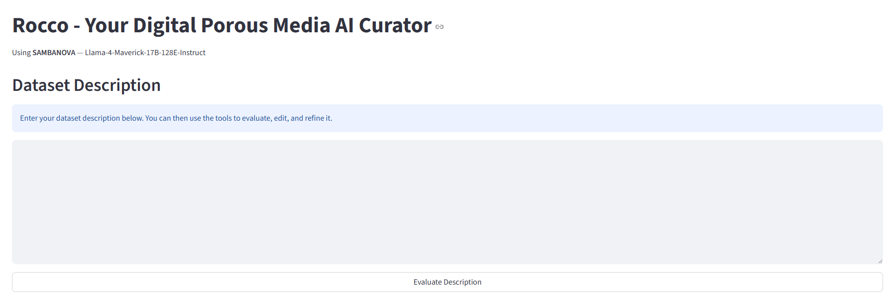
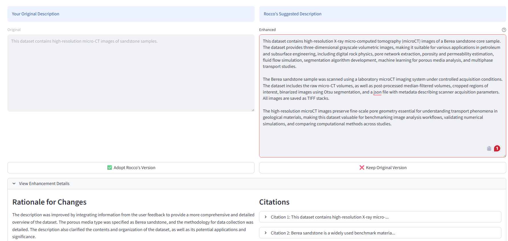

Streamlit App
=============

The Description Curator ships with an interactive web app built on `Streamlit <https://streamlit.io>`_.
It puts all three components — Evaluator, RAG, and Writer — behind a single browser-based workflow
with no coding required.

Launching the App
-----------------

.. code-block:: bash

   streamlit run rocco_ui.py

The app opens at ``http://localhost:8501`` by default.

The Interface
-------------

   *Screenshot placeholder — add after capturing the UI.*

Step-by-Step Workflow
---------------------

**1. Enter a description**

Paste your dataset description into the text area on the left. It can be a few sentences or multiple paragraphs.

**2. Evaluate**

Click **"Evaluate Description"** to score the description against the 10-criterion rubric.
The panel shows:

- A total score out of 10
- Per-criterion pass/fail with a brief explanation of what is missing or well-covered

See :doc:`evaluator` for a detailed breakdown of each criterion.

**3. Upload context documents** *(optional)*

Click **"Upload Files"** and select one or more PDFs or DOCX files — method papers, technical protocols,
or related datasets. Rocco chunks and embeds them into a local FAISS index that persists for the duration
of your browser session.

See :doc:`rag` for details on how ingestion and retrieval work.

**4. Write feedback and enhance**

Type specific feedback in the text area, for example:

- *"Add sample preparation details"*
- *"Explain which segmentation algorithm was used"*
- *"Include porosity or permeability measurements if available"*

Then click **"Enhance with Rocco"**. Rocco first screens your feedback (see :doc:`writer`), then
retrieves relevant excerpts from your uploaded documents and produces an improved description.

**5. Review results**

   *Screenshot placeholder — add after capturing the enhancement result panel.*

The enhanced description appears alongside:

- A **rationale** summarising what changed and why
- **Citations** — each added or modified statement is traced to its source (your feedback, an uploaded paper, or the original description)

You can accept, reject, or manually edit the result, then enhance again.

**6. Iterate**

Click **"Enhance with Rocco"** again with new feedback. Rocco carries the full conversation history
across rounds, so each pass builds on the previous one.

Reading Citations
-----------------

Each citation in the result shows:

.. list-table::
   :widths: 25 75
   :header-rows: 1

   * - Field
     - Meaning
   * - ``statement``
     - The specific sentence or clause that was added or changed
   * - ``source``
     - Where it came from: ``original_description``, ``context_chunk``, or ``user_feedback``
   * - ``quote``
     - The verbatim excerpt from the source that supports the statement
   * - ``doc_title``
     - Filename (without extension) of the uploaded paper, if ``source`` is ``context_chunk``
   * - ``page``
     - Page number in the source PDF, if available

Always review citations before publishing — the LLM can occasionally attribute a claim to a nearby
passage that only loosely supports it.

In-Memory State
---------------

The app stores all state in Streamlit's ``st.session_state``. This means:

- State is **not persisted** to disk — refreshing the browser resets the session
- Uploaded documents and the FAISS index are held in memory for the duration of the session

If you need to save and reload a session across browser restarts, use the programmatic
``DescriptionEditor.save_session()`` / ``load_session()`` interface described in :doc:`writer`.

Common Use Cases
----------------

**Quick evaluation**

Paste a description and click "Evaluate" to get immediate rubric feedback without uploading any documents.
Useful for a fast sanity check before deeper work.

**Full enhancement**

Paste the description, evaluate, upload one or two relevant papers, write targeted feedback, and enhance.
Good for descriptions intended for publication or archival.

**Iterative refinement**

Start from a low-scoring draft. Evaluate → enhance → review → evaluate again. Repeat with progressively
more specific feedback until the score reaches 8+. Good for preparing high-quality submissions.

Troubleshooting
---------------

**"Enhancement failed"**
   Check that ``LLM_API_KEY`` is set correctly in ``.env`` and that your API key has sufficient quota.
   Verify your internet connection, or switch to a local provider (Ollama) in your ``.env``.

**"No context found"**
   Ensure documents were uploaded successfully and are in PDF or DOCX format. Other file types are
   not supported. Try re-uploading or use a different document.

**"Feedback marked as 'Reject'"**
   Rewrite your feedback to be more specific and relevant to the dataset. Avoid vague or off-topic
   instructions. Try splitting long feedback into multiple shorter, focused suggestions.

See Also
--------

- :doc:`evaluator` — How the rubric scoring works
- :doc:`rag` — How document ingestion and retrieval work
- :doc:`writer` — How enhancement and citations work, including session files
- :doc:`configuration` — Switching LLM providers
